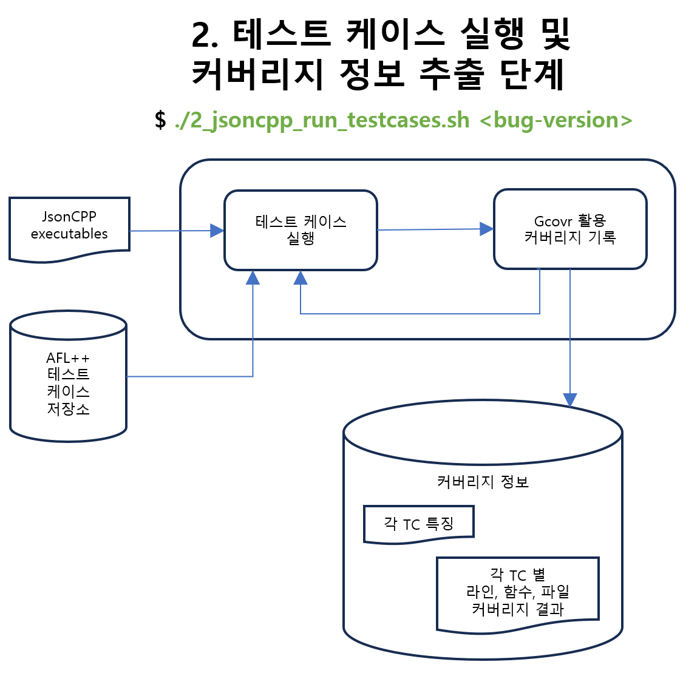
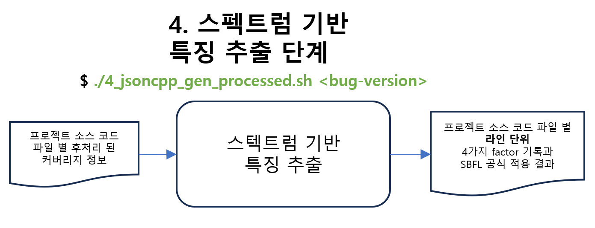
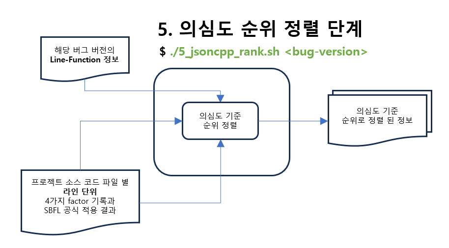

# SBFL_dataset_generator

# 0. 목차
1. [소개](#1-소개)
2. [Github 저장소로부터 도구 다운로드 방법](#2-github-저장소로부터-도구-다운로드-방법)
3. [의돈 도구 (Prerequisites)](#3-의존-도구-prerequisites)
4. [구조 (5개 단계)](#4-구조-5개-단계)
5. [JsonCPP의 테스트 케이스 정보](#5-jsoncpp의-테스트-케이스-정보)
6. [의심도 순위 결과](#6-의심도-순위-결과)
7. [간편 실행 방법](#7-간편-실행-방법)
8. [라인-함수 매핑 제한 조건](#8-라인-함수-매핑-제한-조건)

# 1. 소개
해당 github 저장소에서 개발 된 도구는 Spectrum-Based Fault Localization (SBFL)을 위해 **스펙트럼 기반 특징 데이터셋**을 생성한다.
현재 [JsonCPP](https://github.com/open-source-parsers/jsoncpp) 오픈 소스 프로젝트의 총 **4가지 버전**에만 적용된다. 각 버전에는 **하나의 고유한 버그**가 존재 한다.

# 2. Github 저장소로부터 도구 다운로드 방법
* Github 저장소 링크: https://github.com/yheechan/SBFL_dataset_generator.git
* 다운로드 명령어: 
  ```
  $ git clone https://github.com/yheechan/SBFL_dataset_generator.git
  ```
*  Git 설치 방법: [git 설치 방법 링크](https://git-scm.com/book/ko/v2/%EC%8B%9C%EC%9E%91%ED%95%98%EA%B8%B0-Git-%EC%84%A4%EC%B9%98)

    ### 도구 다운로드 후 디렉토리 구조
    ```
    SBFL_dataset_generator/
    ├─ README.md
    ├─ afl-test-cases/
    ├─ bin/
    ├─ docs/img/
    └─ src/
    ```
      * ```bin/``` 디렉토리는 도구에 실행 명령어들이 위치하고 있다.
      * ```afl-test-cases/``` 디렉토리는 AFL++을 활용해서 jsoncpp에 대하여 추출 한 테스트 케이스(총 **1,029**개)의 저장소이다.
      * ```docs/img/``` 디렉토리는 ```README.md```에서 보이는 이미지들의 저장소이다.
      * ```src/``` 디렉토리는 도구의 작동을 위한 소스 코드의 저장소이다.

**참고 사항:** 해당 문석에서 파일 경로 명시 할 때의 홈 디렉토리는 ```SBFL_dataset_generator/```로 가정합니다.

# 3. 의존 도구 (Prerequisites)
1. Clang/LLVM
    * 버전: 13.0.1 (이 외 버전 사용 불가)
    * 설치 방법 링크: https://apt.llvm.org/
    * 설치 명령어:
        ```
        $ wget https:/apt.llvm.org/llvm.sh
        $ chmod +x llvm.sh
        $ sudo ./llvm.sh 13 all
        ```
    * 환경 설정 필요

2. Gcovr
    * 버전: 6.0 (이 외 버전 사용 불가)
    * 설치 방법 링크: https://gcovr.com/en/stable/installation.html
    * 설치 명령어:
      ```
      $ pip install gcovr==6.0
      ```

3. Python Modules
    * Pandas 버전: 1.1.15
    * Numpy 버전: 1.19.5
    * 설치 명령어:
      ```
      $ pip install pandas==1.15 numpy==1.19.5
      ```

4. Make
    * 버전: 4.1

**참고 사항:** 현재 개발 된 도구는 위에 각 의존 도구들에게 명시 된 버전으로 개발 되었으며, 다른 버전으로 테스트 되지 않았습니다.

# 4. 구조 (5개 단계)


### SBFL_dataset_generator/bin/ 디렉토리 구조 (사용자에게 제공 되는 명령어)
```
SBFL_dataset_generator/bin
├─ SBFL_all.sh
├─ SBFL_single.sh
├─ build_project.sh
├─ gen_processed.sh
├─ gen_spectrum.sh
├─ rank.sh
├─ run_testcases.sh
└─ tools/
```

### ```<bug-version>```에 가능한 입력 값
```<bug-version>``` |
--- |
bug1 |
bug2 |
bug3 |
bug4 |

### ```<bug-version>```의 입력 값을 ```bug1```기준, 단계 별 명령어 예제
* 5개의 단계 별 세부 내용은 다음 장들에서 설명된다.

작업 디렉토리를 ```SBFL_dataset_generator/bin/```으로 이동해서 실행한다:
```
$ ./build_project.sh bug1
$ ./run_testcases.sh bug1
$ ./gen_spectrum.sh bug1
$ ./gen_processed.sh bug1
$ ./rank.sh bug1
```

**참고 사항:** 간편 실행은 [7장](#7-간편-실행-방법)에서 설명된다.

## 4.1 프로젝트 빌드 단계


작업 디렉토리를 ```SBFL_dataset_generator/bin/```으로 이동해서 실행한다:
```
$ ./build_project.sh <bug-version>
```

* ```SBFL_dataset_generator/subjects/``` 디렉토리가 새롭게 생성된다. 
* 사용자가 입력 한 ```<bug-version>``` 버전의 jsoncpp 프로젝트가 ```jsoncpp-<bug-version>/``` 이름으로 ```subjects/``` 디렉토리에 자동 저장된다.
  * ```$ ./build_project.sh bug1``` 명령어를 실행 후 프로젝트 저장 결과
    ```
    SBFL_dataset_generator/
      └─subjects/
        └─ jsoncpp-bug1/
    ```
* 저장하게 된 jsoncpp 프로젝트는 **빌드** 되어 **jsoncpp executables**들이 생성된다.
* jsoncpp의 소스 코드 전처리 파일들로부터 **line-function 정보**가 ```SBFL_dataset_generator/subjects/jsoncpp-<bug-version>/data/line2function/``` 디렉토리 위치에 ```<bug-version>.line2function.json```이름 형식으로 저장된다.
  * jsoncpp의 소스 코드 파일들에 대한 line-function 정보를 하나의 파일 ```<bug-version>.line2function.json```에 담기는 것이다.

  ### ```$ ./build_project.sh bug1``` 명령어 실행 후 **line-function 정보** 저장 결과
  ```
  SBFL_dataset_generator/subjects/jsoncpp-bug1/
    └─ data/
      └─ line2function/
        └─ bug1.line2function.json
  ```
* **line-function** 추출 정보 예시: ```<bug-version>.line2function.json```
  * 프로젝트의 소스 코드 **파일**의 **함수들의 이름**과 해당 함수의 **시작 지점**과 **끝나는 지점**을 json 포맷으로 저장한다
  ```
  {
    …
    “file1.cpp": [
      [“ClassA::foo(int x)”, 10, 15],
      [“ClassA::boo(int x)", 17, 24],
      …
    ],
    …
  }
  ```
**참고 사항:** line-function 정보에 대한 제한 조건은 [8장](#8-라인-함수-매핑-제한-조건)에서 설명된다.

## 4.2 테스트 케이스 실행 및 커버리지 정보 추출 단계


작업 디렉토리를 ```SBFL_dataset_generator/bin/```으로 이동해서 실행한다:
```
$ ./run_testcases.sh <bug-version>
```

* jsoncpp executables로부터 jsoncpp의 테스트 케이스 (127개), AFL++로 추출한 테스트 케이스 (1029개)를 각각 실행한다. (모든 테스트 케이스가 한번씩 순차적으로 실행된다)
* 하나의 테스트 케이스를 실행한 후, **gcovr**를 통해 **라인, 함수, 파일 커버리지 정보**를:
  * ```SBFL_dataset_generator/subjects/jsoncpp-<bug-version>/data/coverage/raw/``` 디렉토리에 ```<bug-version>.<tc-name>.raw.json``` 이름 형식으로 저장된다. 해당 파일은 해당 테스트 케이스의 **라인과 함수 커버리지 정보**를 저장한다.
  * ```SBFL_dataset_generator/subjects/jsoncpp-<bug-version>/data/coverage/summary/``` 디렉토리에 ```<bug-version>.<tc-name>.summary.json``` 이름 형식으로 저장된다. 해당 파일은 해당 테스트 케이스의 **파일 커버리지 정보**를 저장한다.
  * 커버리지 정보는 **gcovr**의 json 형식으로 저장된다.
    * gcovr의 json 아웃풋 형식 설명 링크: https://gcovr.com/en/stable/output/json.html#json-output
* 모든 테스트 케이스를 실행 항 후 추출 된 커버리지 결과로부터:
  * **각 테스트 케이스들의 특징**을 ```SBFL_dataset_generator/subjects/jsoncpp-<bug-version>/data/criteria/``` 디렉토리에 ```<bug-version>.stat.csv``` 이름 형식으로 저장된다.
  *  **우연히 버기 라인을 실행하고도 pass 된 테스트 케이스 (coincident TC)** 정보를 ```SBFL_dataset_generator/subjects/jsoncpp-<bug-version>/data/coverage/coincident/``` 디렉토리에 ```<bug-version>.coincidentTC.txt``` 이름 형식으로 기록된다.
  * [5장](#5-jsoncpp의-테스트-케이스-정보)에서 **각 테스트 케이스들의 특징**과 **coincident TC** 정보 관련 내용이 자세희 설명된다.

### ```$ ./run_testcases.sh bug1``` 명령어 실행 후 커버리지 정보 저장 결과
```
SBFL_dataset_generator/subjects/jsoncpp-bug1/data/
├─ coverage/
|    ├─ coincident/
|    |   └─ bug1.coincidentTC.txt
|    ├─ raw/
|    |   | …
|    |   ├─ bug1.TC126.raw.json
|    |   └─ bug1.TC127.raw.json
|    └─ summary/
|        | …
|        ├─ bug1.TC126.summary.json
|        └─ bug1.TC127.summary.json
└─ criteria/
    └─ bug1.stat.csv
```

## 4.3 커버리지 결과 csv 포맷으로 후처리 단계


작업 디렉토리를 ```SBFL_dataset_generator/bin/```으로 이동해서 실행한다:
```
$ ./gen_spectrum.sh <bug-version>
```

* gcovr 도구를 통해 추출 한 테스트 케이스 별 커버리지 결과를 **csv 포맷으로 후처리**한다.
  * Coincident TC들은 제외된다. ([5장](#5-jsoncpp의-테스트-케이스-정보)에서 coincident TC 제외 관련 내용이 자세히 설명된다)
  * 후처리 된 결과는 ```SBFL_dataset_generator/subjects/jsoncpp-<bug-version>/data/spectra/```데렉토리에 **jsoncpp의 소스 코드 파일** 별로 ```<bug-version>.<file-name>.csv``` 이름 형식으로 저장된다.

  ### ```$ ./gen_spectrum bug1``` 명령어 실행 후 생성 되는 파일 구조 (예시):
  ```
  SBFL_dataset_generator/subjects/jsoncpp-bug1/data/
  └─ spectra/
      |  … 
      ├─ bug1.file4.cpp.csv
      └─ bug1.file5.cpp.csv
  ```

### 커버리지 결과의 후처리 파일 내용 및 설명: ```spectra/<bug-version>.<file-name>.csv```
Line no. | TC1 | TC2 | ... 
--- | --- | --- | ---
```<bug-version>#<file-name>#<func-name>#<line-number>``` | 0 | 1 | ...
```bug1#file1.cpp#ClassA::foo(int x)#10``` | 0 | 1| ...
... | ... | ... | ...


* ```line no.```열은 ```버그버전#파일명#함수명#라인위치``` 형식으로 해당 소스 코드 파일의 **라인**들을 표한다.
* 2번째 열 ~ N번째 열은 각 테스트 케이스 별 해당 라인에 대한 **실행 여부**를 뜻한다.
  * 해당 라인이 실행 되었을 때 1, 실행 되지 않았을 때 0으로 표시한다.
  * N의 개수는, jsoncpp 테스트 케이스의 개수에서 **coincident TC** 개수를 제외 한 개수이다. ([5장](#5-jsoncpp의-테스트-케이스-정보)에서 테스트 케이스 개수 내용이 자세히 설명된다)

## 4.4 스펙트럼 기반 특징 추출 단계


작업 디렉토리를 ```SBFL_dataset_generator/bin/```으로 이동해서 실행한다:
```
$ ./gen_processed.sh <bug-version>
```

* 후처리 된 커버러지 정보로부터 **라인 단위** 스펙트럽 기반 특징을 추출한다.
  * 스펙트럼 기반 특징은 ```ep, ef, np, nf```와 **SBFL formula** 적용 결과가 있다.
  * 스펙트럽 기반 특징 결과는 ```SBFL_dataset_generator/subjects/jsoncpp-<bug-version>/data/processed/``` 디렉토리에 **jsoncpp의 소스 코드 파일** 별로 ```<bug-version>.<file-name>.csv``` 이름 형식으로 저장된다.

  ### 파일 구조 예시는 다음 그림과 같다:
  ```
  SBFL_dataset_generator/subjects/jsoncpp-bug1/data/
  └─ processed/
      |  … 
      ├─ bug1.file4.cpp.csv
      └─ bug1.file5.cpp.csv
  ```

### 스펙트럼 기반 특징 결과 파일 내용 및 설명: ```processed/<bug-version>.<file-name>.csv```
Line no. | ep | ef | np | nf | Binary | GP13 | Jaccard | Naish1 | Naish2 | Ochiai | Russel+Rao | Wong1 | bug
--- | --- | --- | --- | --- | --- | --- | --- | --- | --- | --- | --- | --- | ---
```<bug-version>#<file-name>#<func-name>#<line-number>``` | 33 | 3 | 60 | 1 | 0 | 2.5 | 0.5 | -1 | 1.98 | 0.67 | 0.02 | 2 | 0
```bug1#file1.cpp#ClassA::foo(int x)#10``` | 0 | 3 | 93 | 0 | 1 | 4.0 | 1.0 | 93 | 3.0 | 1.0 | 0.03125 | 3 | 1
... | ... | ... | ... | ... | ... | ... | ... | ... | ... | ... | ... | ... | ... | ...

* ```line no.```열은 ```버그버전#파일명#함수명#라인위치``` 형식으로 해당 소스 코드 파일의 라인들을 표한다.
* ```ep, ef, np, nf```의 의미:
  * **ef** : 해당 라인을 실행하고 fail한 테스트 수 (Executed & Failed)
  * **nf** : 해당 라인을 실행하지 않고 fail한 테스트 수 (Not-executed & Failed)
  * **ep** : 해당 라인을 실행하고 pass한 테스트 수 (Executed & Passed)
  * **np** : 해당 라인을 실행하지 않고 pass한 테스트 수 (Not-executed & Passed)
* [6장](#6-의심도-순위-결과)에서 명시 된 **8개의 SBFL formula**를 각 **라인**에 적용 한 의심도 결과
* ```bug```열은 해당 라인이 **버기 라인인 경우** 1, **버기 라인이 아닌** 경우 0으로 표시한다.

## 4.5 의심도 순위 정열 단계


작업 디렉토리를 ```SBFL_dataset_generator/bin/```으로 이동해서 실행한다:
```
$ ./rank.sh <bug-version>
```

### 라인 단위 결과
* **라인 단위** 스펙트럼 특징 결과로부터 **높은 의심도**에서 **낮은 의심도** 순서로 정열한다.
  * 라인 단위 의심도 순위로 정열 된 정보는 ```SBFL_dataset_generator/subjects/jsoncpp-<bug-version>/data/ranked-line/``` 디렉토리에 **8개의 SBFL formula** 별로 ```<bug-version>.<sbfl-formula>.csv``` 이름 형식으로 저장된다.
* 모든 SBFL formula 기준 버기 라인의 순위를 정리 한 요약 표를 ```SBFL_dataset_generator/subjects/jsoncpp-<bug-version>/data/ranked-line/``` 디렉토리에 ```<bug-version>.rank.summary.csv``` 이름 형식으로 저장된다. (해당 표는 [6장](#6-의심도-순위-결과)에서 설명)

  ### 라인단위 스펙트럼 기반 특징 결과 파일 내용 및 설명: ```ranked-ㅣline/<bug-version>.<file-name>.csv```
  Line no. | ep | ef | np | nf | Binary | GP13 | Jaccard | Naish1 | Naish2 | Ochiai | Russel+Rao | Wong1 | bug | rank
  --- | --- | --- | --- | --- | --- | --- | --- | --- | --- | --- | --- | --- | --- | ---
  ```bug1#file1.cpp#ClassA::foo(int x)#10``` | 0 | 3 | 93 | 0 | 1 | 4.0 | 1.0 | 93 | 3.0 | 1.0 | 0.03125 | 3 | 1 | 1
  ```<bug-version>#<file-name>#<func-name>#<line-number>``` | 33 | 3 | 60 | 1 | 0 | 2.5 | 0.5 | -1 | 1.98 | 0.67 | 0.02 | 2 | 0| 2
  ... | ... | ... | ... | ... | ... | ... | ... | ... | ... | ... | ... | ... | ... | ... | ...

    * ```line no.```열, ```ep, ef, np, nf```열, **SBFL formula 의심도 결과**열, ```bug```열은 [4.4](#44-스펙트럼-기반-특징-추출-단계)단계에서 제시한 예제와 동일하다.
    * 새롭게 추가 된 ```rank```열은 SBFL formula의 의심도 결과 기준 라인의 순위를 의미한다.

### 함수 단위 결과
* **라인 단위** 스펙트럼 특징 결과와 **line-function** 정보를 참고해서 각 함수를 대표하는 라인을 **의심도가 가장 높은 라인**으로 선택해서 **함수 단위** 스펙트럼 특징 결과로 변환한다.
* **함수 단위** 스펙트럼 특징 결과로부터 **높은 의심도**에서 **낮은 의심도** 순서로 정열한다.
  * 함수 단위 의심도 순위로 정열 된 정보는 ```SBFL_dataset_generator/subjects/jsoncpp-<bug-version>/data/ranked-function/``` 디렉토리에 **8개의 SBFL formula** 별로 ```<bug-version>.<sbfl-formula>.csv``` 이름 형식으로 저장된다.
* 모든 SBFL formula 기준 버기 함수의 순위를 정리 한 요약 표를 ```SBFL_dataset_generator/subjects/jsoncpp-<bug-version>/data/ranked-function/``` 디렉토리에 ```<bug-version>.rank.summary.csv``` 이름 형식으로 저장된다. (해당 표는 [6장](#6-의심도-순위-결과)에서 설명)

  ### 함수단위 스펙트럼 기반 특징 결과 파일 내용 및 설명: ```ranked-function/<bug-version>.<file-name>.csv```
  Line no. | ep | ef | np | nf | Binary | GP13 | Jaccard | Naish1 | Naish2 | Ochiai | Russel+Rao | Wong1 | bug | rank
  --- | --- | --- | --- | --- | --- | --- | --- | --- | --- | --- | --- | --- | --- | ---
  ```bug1#file1.cpp#ClassA::foo(int x)``` | 0 | 3 | 93 | 0 | 1 | 4.0 | 1.0 | 93 | 3.0 | 1.0 | 0.03125 | 3 | 1 | 1
  ```<bug-version>#<file-name>#<func-name>``` | 33 | 3 | 60 | 1 | 0 | 2.5 | 0.5 | -1 | 1.98 | 0.67 | 0.02 | 2 | 0| 2
  ... | ... | ... | ... | ... | ... | ... | ... | ... | ... | ... | ... | ... | ... | ... | ...

  * ```line no.```열은 ```버그버전#파일명#함수명``` 형식으로 jsoncpp 프로젝트의 함수들을 표한다.
  * ```ep, ef, np, nf```열, **SBFL formula 의심도 결과**열, ```bug```열은 [4.4](#44-스펙트럼-기반-특징-추출-단계)단계에서 제시한 예제와 동일하다.
  * 새롭게 추가 된 ```rank```열은 SBFL formula의 의심도 결과 기준 함수의 순위를 의미한다.

### ```$ ./rank.sh bug1``` 실행 후 함수 단위 순위 결과 예시
```
SBFL_dataset_generator/subjects/jsoncpp-bug1/data/
└─ ranked-function/
|   | …
|   ├─ bug1.ranked.summary.csv
|   ├─ bug1.Naish2.csv
|   └─ bug1.Ochiai.csv
└─ ranked-line/
    | …
    ├─ bug1.ranked.summary.csv
    ├─ bug1.Naish2.csv
    └─ bug1.Ochiai.csv
```

# 5. JsonCPP의 테스트 케이스 정보
* 총 1,156개의 테스트 케이스 존재
  * 각 4개의 버그 버전 별 **3개의 failing 테스트 케이스**가 있다.
  * 다음 표는 각 버그 별, 1,156개 테스트 케이스 중, 스펙트럼 특징 정보 추출에 사용된 테스트 케이스의 개수를 보인다

    ```<bug-version>``` | 사용 테스트 케이스 개수
    --- | ---
    bug1 | 1,155개
    bug2 | 1,156개
    bug3 | 98개
    bug4 | 1,129개

* 테스트 케이스의 출처
  * 총 11개 테스트 케이스는 **본인이 추가**
  * 총 119개 테스트 케이스는 **JsonCPP 제작**
  * 총 1,029개 테스트 케이스는 **AFL++** 활용해서 제작
* 127개 (11개 본인, 119개 JsonCPP) 테스트 케이스 파일 위치: ```SBFL_dataset_generator/subjects/jsoncpp-<bug-version>/src/test_lib_json/main.cpp```
  ### 테스트 케이스 예시 (TC4)
  ```
  JSONTEST_FIXTURE_LOCAL(ReaderTest, allowNumericKeysTest_1) {
    Json::Features features;
    features.allowNumericKeys_ = true;
    setFeatures(features);
    checkParse(R"({ 123 : "abc" })");
  }
  ```
* 1,029개 (AFL++) 테스트 케이스 저장 위치: ```SBFL_dataset_generator/afl-test-cases/output/default/queue/``` 

### Jsoncpp 테스트 케이스와 AFL++ 테스트 케이스 커버리지 차이
출처 | 테스트 케이스 개수 | 라인 커버리지
--- | --- | ---
본인과 JsonCPP | 127개 | 91.4%
AFL++ | 1,029개 | 13.4%
  * 위 표는 각 출처에서 제작 된 테스트 케이스를 모두 실행했을 때 jsoncpp 프로젝트 전체의 라인 커버리지 결과이다.
  * JsonCPP은 단일 실행 파일이 아닌 라이브러리입니다. 따라서 AFL++이 생성한 테스트 케이스는 JsonCPP의 퍼저 드라이버 내부에 있는 parse() 함수에 집중되어 있습니다.

### 다음 표는 failing 테스트 케이스에 대한 내용을 보인다
```<tc-name>``` | description (schema, test) | ```<bug-version>``` | buggy file name | buggy function | buggy line # | bug type | 라인 커버리지 | 출처
--- | --- | --- | --- | --- | --- | --- | --- | ---
TC1 | ValueTest, issue1264_1 | bug1 | json_value.cpp | Json::Value::resize(unsinged int) | 915 | Assertion Violation: Updated size of an array type | 8% | 본인
TC2 | ValueTest, issue1264_2 | bug1 | json_value.cpp | Json::Value::resize(unsinged int) | 915 | Assertion Violation: Updated size of an array type | 8% | 본인
TC3 | ValueTest, issue1264_3 | bug1 | json_value.cpp | Json::Value::resize(unsinged int) | 915 | Assertion Violation: Updated size of an array type | 8% | 본인
TC4 | ReaderTest, allowNumericKeysTest_1 | bug2 | json_reader.cpp | Json::Reader::readObject(Json::Reader::Token&) | 467 | Assertion Violation: Input type (expecting string Value) | 9% | JsonCPP
TC5 | ReaderTest, allowNumericKeysTest_2 | bug2 | json_reader.cpp | Json::Reader::readObject(Json::Reader::Token&) | 467 | Assertion Violation: Input type (expecting string Value) | 9% | 본인
TC6 | ReaderTest, allowNumericKeysTest_3 | bug2 | json_reader.cpp | Json::Reader::readObject(Json::Reader::Token&) | 467 | Assertion Violation: Input type (expecting string Value) | 10% | 본인
TC7 | CharReaderTest, ossFuzz_21916_1 | bug3 | json_reader.cpp | Json::OurReader::skipBom(bool) | 1279 | heap overflow | 10% | 본인
TC8 | CharReaderTest, ossFuzz_21916_2 | bug3 | json_reader.cpp | Json::OurReader::skipBom(bool) | 1279 | heap overflow | 13% | 본인
TC9 | CharReaderTest, ossFuzz_21916_3 | bug3 | json_reader.cpp | Json::OurReader::skipBom(bool) | 1279 | heap overflow | 13% | 본인
TC10 | CharReaderTest, ossFuzz_18147_1 | bug4 | json_reader.cpp | Json::OurReader::decodeNumber(Json::ourReader::Token&, Json::Value&) | 1628 | integer overflow | 10% | 본인
TC11 | CharReaderTest, ossFuzz_18147_2 | bug4 | json_reader.cpp | Json::OurReader::decodeNumber(Json::ourReader::Token&, Json::Value&) | 1628 | integer overflow | 11% | 본인
TC12 | CharReaderTest, ossFuzz_18147_3 | bug4 | json_reader.cpp | Json::OurReader::decodeNumber(Json::ourReader::Token&, Json::Value&) | 1628 | integer overflow | 11% | 본인

### Coincident Test-Case
* 버그 버전 별 **버기 라인**을 실행 했으나 **우연히 pass 하는 테스트 케이스**들은 제외된다.
  * Coincident TC를 제외 하므로, 버그 함수 예층 **성능이 향상**된다.

  ### 버그 버전 별 버기 라인을 실행 헀으나 우연히 pass 한 테스트 케이스의 개수 :
    * 파일: ```/coincident/<bug-version>.coincidentTC.txt``` ([4.2](#42-테스트-케이스-실행-및-커버리지-정보-추출-단계)장에서 소개)

  ```<bug-version>``` | Coincident TC 개수
  --- | ---
  bug1 | **1**개
  bug2 | **0**개
  bug3 | **1,058**개
  bug4 | **27**개

  ### 다음 표는 각 버그 버전에서 테스트 케이스들의 **특징** 정보를 보인다:
    * 파일: ```criteria/<bug-version>.stat.csv``` ([4.2](#42-테스트-케이스-실행-및-커버리지-정보-추출-단계)장에서 소개)

  ```<bug-version>``` | 기준 | bug 실행 후 pass 하는 TC 개수 | bug 실행 후 fail 하는 TC 개수 | bug 실행 하지 않는 TC 개수
  --- | --- | --- | --- | --- |
  bug1 | file | 1,153 | 3 | 0
  bug1 | function | 2 | 3 | 1,151
  bug1 | line | **1** | 3 | 1,152
  bug2 | file | 1,153 | 3 | 0
  bug2 | function | 10 | 3 | 1,143
  bug2 | line | **0** | 3 | 1,153
  bug3 | file | 1,152 | 3 | 1
  bug3 | function | 1,059 | 3 | 94
  bug3 | line | **1,058** | 3 | 95
  bug4 | file | 1,153 | 3 | 0
  bug4 | function | 243 | 3 | 910
  bug4 | line | **27** | 3 | 1,126

* [Understand by SciTool](https://scitools.com/) 활용 JsonCPP 저장소 분석 결과:
  * 총 file 개수: ~ 40
  * 총 function 개수: ~ 1,000
  * 총 line 개수: ~ 10,000

# 6. 의심도 순위 결과
### 라인 단위 버기 함수의 의심 순위:
  * ```ranked-line/<bug-version>.summary.csv``` ([4.5](#45-의심도-순위-정열-단계)장에서 소개)

```<bug-version>``` | Binary | GP13 | Jaccard | Naish1 | Naish2 | Ochiai | Russe+Rao | Wong1
--- | --- | --- | --- | --- | --- | --- | --- | ---
bug1 | 539 | 29 | 29 | 29 | 29 | 29 | 539 | 539
bug2 | 617 | 30 | 30 | 30 | 30 | 30 | 617 | 617
bug3 | 680 | 45 | 45 | 45 | 45 | 45 | 680 | 680
bug4 | 676 | 3 | 3 | 3 | 3 | 3 | 676 | 676

### 함수 단위 버기 함수의 의심 순위:
  * ```ranked-function/<bug-version>.summary.csv``` ([4.5](#45-의심도-순위-정열-단계)장에서 소개)

```<bug-version>``` | Binary | GP13 | Jaccard | Naish1 | Naish2 | Ochiai | Russe+Rao | Wong1
--- | --- | --- | --- | --- | --- | --- | --- | ---
bug1 | 211 | 5 | 5 | 5 | 5 | 5 | 211 | 211
bug2 | 220 | 7 | 7 | 7 | 7 | 7 | 220 | 220
bug3 | 228 | 8 | 8 | 8 | 8 | 8 | 228 | 228
bug4 | 227 | 1 | 1 | 1 | 1 | 1 | 227 | 227

### 총 8개의 SBFL formula를 보인다


# 7. 간편 실행 방법
* 한번의 실행으로 모든 버그 버전들의 **SBFL 데이터셋 생성**
  * 작업 디렉토리를 ```SBFL_dataset_generator/bin/```으로 이동해서 실행한다:
    ```
    $ ./SBFL_all.sh
    ```
  * 각 버그 버전 별 추출 된 모든 정보들은 하나의 디렉토리, ```SBFL_dataset_generator/overall/```에 모음으로 저장된다.

  ### ```<SBFL_all.sh>``` 실행 후 ```SBFL_dataset_generator/overall/``` 디렉토리 구조
  ```
  SBFL_dataset_generator/overall/
  ├── coverage/
  ├── criteria/
  ├── line2function/
  ├── processed/
  ├── ranked-function/
  ├── ranked-line/
  └── spectra/
  ```

* 하나의 버그 버전의 **SBFL 데이터셋 생성**
  * 작업 디렉토리를 ```SBFL_dataset_generator/bin/```으로 이동해서 실행한다:
    ```
    $ ./SBFL_single.sh <bug-version>
    ```
  * 소유 시간 약 4분 10초.

# 8. 라인-함수 매핑 제한 조건
  * 데이터셋에서 각 라인은 다음 형식으로 표시된다
    ```
    <bug-version>#<file-name>#<func-name>#<line-number>
    ```
  * 다음과 같은 코드 라인들은 ```<func-name>```이 인식 되지 않기에 (즉, clang이 해당 구문의 function을 identify하지 못하므로) ```FUNCTIONNOTFOUND```로 표시한다.
    1. Line that defines a class
    2. Line that defines a struct
    3. Line that defines a field
    4. Line that defines a global variable
    5. C directives (i.e., preprocessing directives, 전처리 지시자)

    ### JsonCPP 소스 코드 파일 별 함수가 인식 되지 않는 라인의 개수
    파일명 | 라인-함수 매핑 되지 못한 라인의 개수 | 유형
    --- | --- | ---
    CMakeCXXCompilerId | 0줄 | []
    reader.h | 5줄 | [1, 2]
    value.h | 5줄 | [1, 2]
    writer.h | 2줄 | [1, 2]
    jsontestrunner/main.cpp | 1줄 | [2]
    lib_json/json_reader.cpp | 19줄 | [1, 2, 3, 4, 5]
    lib_json/json_tool.cpp | 0줄 | []
    lib_json/json_value.cpp | 3줄 | [4]
    lib_json/json_valueiterator.inl | 0줄 | []
    lib_json/json_writer.cpp | 1줄 | [2]
    fuzz.cpp | 0줄 | []
    jsontest.cpp | 2줄 | [5]
    jsontest.h | 3줄 | [1]
    test_lib_json/main.cpp | 50줄 | [2, 4]
